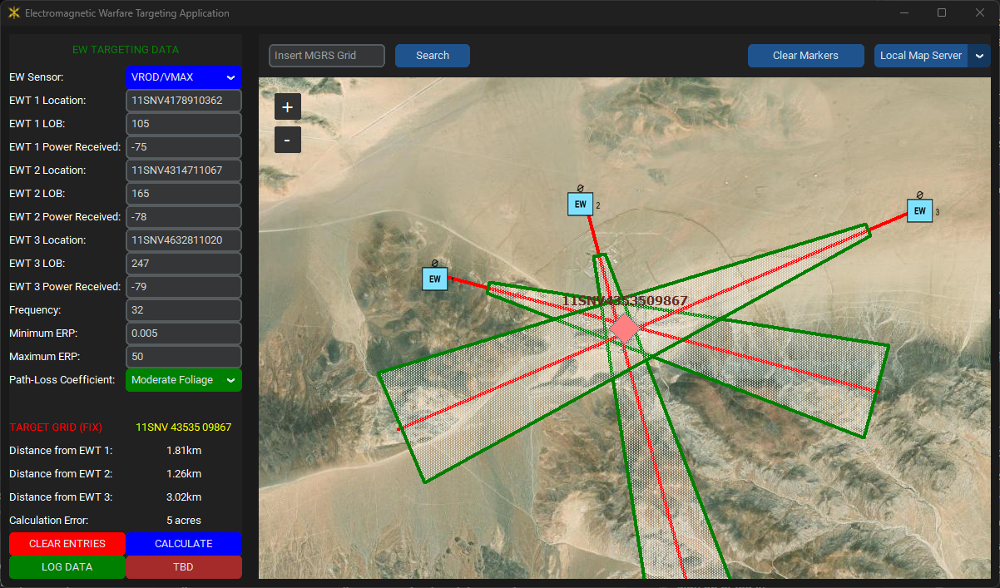

# Overview:

The Electromagnetic Warfare Targeting Application revolutionizes EW platoons' operations by streamlining their targeting process. Users input a LOB 3-Line (Sensor MGRS, LOB orientation, PWR Received) and the application reverse-engineers the detected radio signals and swiftly identifies and analyzes potential targets in real-time. The application allows the aggregation of EW targeting data from three EW teams (EWTs). The application integrates target data onto an offline digital map to enhance situational awareness and better enable precise targeting. This innovative tool empowers EW units to aggregate target data across their EWTs, significantly reducing the time required to detect, identify, and deliver effects on targets with decisive levels efficiency and accuracy.



## Installation Instructions:

#### Install on Linux using Bash:
```bash
# download package information from all configured sources 
sudo apt-get update
# install python
sudo apt-get install python
# verify python version
python --version
# create a virtual python environment titled "ewta_venv"
python -m venv ewta_venv
# activate the virtual environment
source ./bin/activate
# install required python modules
pip install -r requirements.txt
```

#### Install on Windows using Git Bash:
```Bash

```

Install on Windows using PowerShell:

#### Run EW Targeting Application

Windows
```cmd
run.bat
```
Linux
```bash
source ewta_venv/Scripts/activate
run.bash
```

## How to Use:

Instructions with screen shots