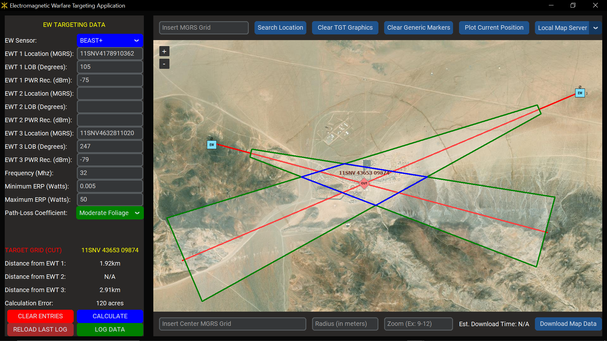
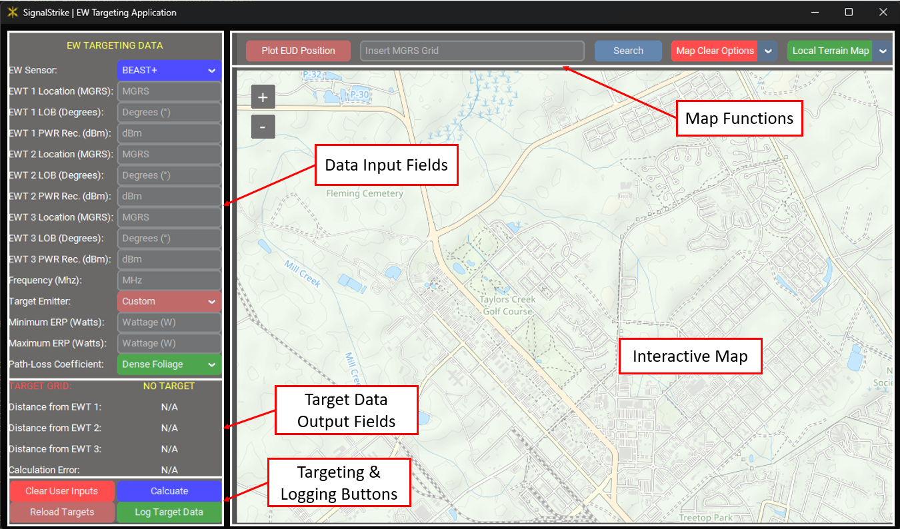
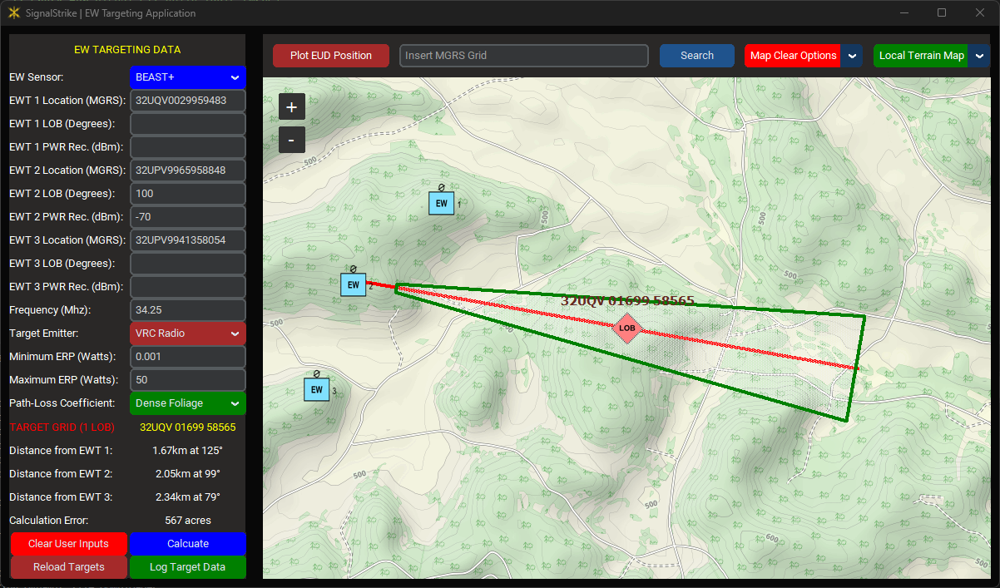

# Overview

The Electromagnetic Warfare Targeting Application, named SignalStrike, supports EW platoons' operations by streamlining their targeting process. Users input a LOB 3-Line (Sensor MGRS, LOB orientation, PWR Received), and the application reverse-engineers the target signal, identifying the location of potential targets in real-time. The application allows the aggregation of EW targeting data from up to three EW teams (EWTs). The application integrates target data onto an offline digital map to enhance situational awareness and enable precise targeting. This innovative tool empowers EW units to aggregate target data across their EWTs, significantly reducing the time required to detect, identify, and deliver effects on targets with decisive levels of efficiency and accuracy.



# Installation

#### Install on Linux:
```bash
# download package information from all configured sources 
sudo apt-get update
# install python
sudo apt-get install python
# verify python version
python --version
# install git
sudo apt install git-all
# clone git repository
git clone "https://github.com/Shuttdown700/ew_plt_targeting_app"
# change directory to EW Target App directory
cd ./ew_plt_targeting_app
# create a virtual python environment titled "venv"
python -m venv env
# activate the virtual environment
source ./venv/bin/activate
# install required python modules
pip install -r requirements.txt
```

#### Install on Windows:
1. Download **Python**

    **Method 1:** Download from the Microsoft Store

    **Method 2:** Download from 
<a href="https://www.python.org/downloads/" style="font-style: italic">
    Python.org
</a>

2. Download **Git for Windows** from
<a href="https://git-scm.com/download/win" style="font-style: italic">
    git-scm.com
</a>

3. Open a **Command (cmd) Prompt** and input the following commands:
```sh
# ensure Git is updated
git update-git-for-windows
# verify python version
python --version
# clone git repository
git clone "https://github.com/Shuttdown700/ew_plt_targeting_app"
# change directory to EW Target App directory
cd ./ew_plt_targeting_app
# create a virtual python environment titled "venv"
python -m venv venv
# activate the virtual environment
source ./venv/scripts/activate
# update Python's Pip module
python -m pip install --upgrade pip
# install required python modules
python -m pip install -r requirements.txt
```

# Run Application
- From Window's command prompt:
```sh
# Start the EW Targeting Application
run.bat
```
- From Linux Bash shell:
```bash
# Start the EW Targeting Application
run.sh
```

# User-Interface Layout


# Functions [WORK IN PROGRESS]
#### **Single LOB Targeting Function:**

Mention all the user input fields for targeting and target output fields
#### **Multi-LOB Targeting Function (CUT/FIX):**

Describe CUT

Describe FIX
Mention cuts and fixes, as well as non-intersecting LOBs
#### **Target Overlay Interactability**
Selecting an EWT

Selecting a LOB

Selecting a CUT

Selecting a FIX

#### **Locally-Host Map Server:**

#### **Logging Function:**
No picture needed
#### **Plotting Current Location Function**

#### **Dynamic Marker Plotting**


#### **Dynamic Distance Measuring**

#### **Grid Copying Feature**


Mention that holding click = right-click
#### **Dynamic Map Download Service**

Mention requirement for internet connection
#### **Bulk Map Download Service**
Add CTC and post download parameters

# Future Functions [WORK IN PROGRESS]
#### **Terrain Context in Targeting Function**
...
#### **Service for receiving remote sensor data**
...
#### **Integrated EW Planning Function**
...
#### **Advanced Logging Features**
...
#### **Post-Mission Analysis Function**
...
#### **Unit Testing (for Development)**
...
