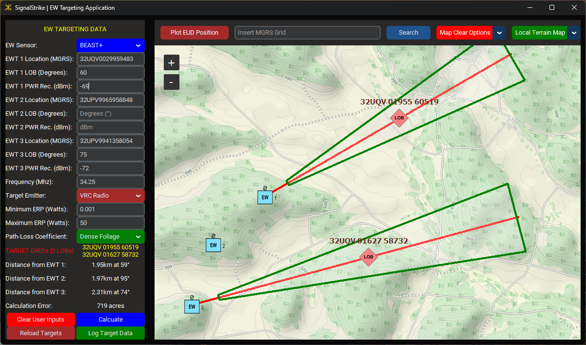

# Overview

The Electromagnetic Warfare (EW) Targeting Application, dubbed "SignalStrike", supports EW platoons' operations by streamlining their targeting process. Users input a Line-of-Bearing (LOB) LOB 3-Line (the sensor MGRS, its LOB grid azimuth, and the power received from the signal) and the application reverse-engineers the received target signal, overlaying the target area of the source emitter in real-time. The application allows the aggregation of EW sensor data from up to three EW teams (EWTs), and any combination of EWTs. SignalStrike ingests user-input sensor data and presents the generated target data onto an offline, digital, and interactive map to enhance situational awareness and enable effective targeting of signals-of-interest (SOI). This innovative and essential tool enables EW Platoons to rapidly aggregate raw sensor data from their EWTs and generate accurate target data that is clearly communicated through a single user interface. SignalStrike significantly reduces the time required to detect, identify, and deliver effects on targets with decisive levels of efficiency and accuracy, a capability currently unavailable at the Platoon-level through Army Programs of Record.

SignalStrike began development in October 2023 following a frustrating rotation at the Joint Multinational Training Center (JMRC) wherein EW operators failed to efficiently and accurately cross-reference radio frequency (RF) sensor data and generate accurate RF-based target data in real-time, significantly reducing the utility of the EW Platoon within the assigned unit. During the Combined Resolve (CbR) rotation, the EW Soldiers rapidly developed a command line-based software prototype to ingest RF sensor data and programmatically generate target data; this prototype is considered the first iteration of SignalStrike. The unique value of this software tool was its ability to generate accurate target areas from a single RF sensor's data through a reverse-propagation model, subject to assumptions of the target emitter and operating environment; a capability not yet available to any conventional EW Platoon. This feature, combined with its ability to overlay the target geometry onto a digital map, remains at the core of SignalStrike's value proposition. Following the JMRC rotation, SignalStrike underwent two follow-on development sprints and underwent comprehensive field testing by multiple EW Platoons in the tactical environment at the National Training Center (NTC) in July 2024 and again at JMRC in May 2025. Each field test generated overall positive user feedback and led to the development of features, such as enhanced map features, positioning features, and thorough event logging, based on the end-user's requirements. 


# Installation

#### Install on Windows 10/11:
1. Download **Python 3**.

    **Method 1:** Download from the Microsoft Store.

    **Method 2:** Download from [Python.org](https://www.python.org/downloads/).

2. Download **Git for Windows** from [git-scm.com](https://git-scm.com/download/win).

3. Download **Microsoft C++ Build Tools** from [visualstudio.microsoft.com](https://visualstudio.microsoft.com/visual-cpp-build-tools/)

5. Open a **Command (cmd) or Powershell Prompt**.

4. Input the following commands:
```sh
# ensure Git is updated
git update-git-for-windows
# verify python version
python --version
# change directory to your user's home directory
cd %USERPROFILE%
# clone git repository
git clone "https://github.com/Shuttdown700/SignalStrike.git"
# change directory to the SignalStrike directory
cd ./SignalStrike
# run the setup.bat script
./setup.bat
```

# Run Application
- **Method 1:** Click on the "launch" Desktop icon (i.e. the **Rocket icon**)


- **Method 2:** From Window's command or PowerShell terminal:
```sh
# change directory to SignalStrike directory
cd %USERPROFILE%/SignalStrike
# launch the SignalStrike Application
./launch.bat
```

# User-Interface Layout
<p align="center">
  
</p>

# Functions
### **Single LOB Targeting Function:**
This core feature generates an estimated target area from a single RF sensor's LOB. The user must assume the target transmitter's minimum and maximum effective radiated power (ERP) and must assert the path-loss coefficient by selecting the foliage density along the LOB's path. When the user clicks "Calculate", SignalStrike will reverse-engineer the received signal based on the input data and user assumptions to generate an estimated transmission origin and area of error, taking into account sensor and environmental parameters. This area of error represents the target area. From here, users can adjudicate the location of the emitter further by opting to generate a **two-dimensional elevation plot** along the LOB and by interacting with and analyzing the target area on the map to refine the target emitter's location further.

<p align="center">
  
</p>

<p align="center">
  
</p>

### **Multi-LOB Targeting Function (CUT/FIX):**
In addition to generating a target area from a single RF sensor, SignalStrike can process RF sensor data from up to three EWTs to generate multiple and higher-fidelity target overlays. During the calculation process, SignalStrike assesses if the various EWTs' LOBs generate a CUT (two intersecting LOBs) or a FIX (three intersecting LOBs), with CUTs outlined in blue and a FIX outlined in yellow. Typically, the gold standard for an EW Platoon is to get a FIX on a target emitter, thus maximizing the accuracy of the estimated target location. However, through experimentation, EW Platoons noticed that, on average, the target error (measured in acres) significantly reduces between LOB-based target areas and CUT-based target areas. This difference in target fidelity between LOBs and CUTs averaged to be about x15: for example, 900 acres (LOB) to 60 acres (CUT) of error. That said, the difference in fidelity between CUT-based target areas and FIX-based target areas is only about x3: for example, 60 acres (CUT) to 20 acres (FIX) of error. This finding, which was discovered during the NTC field test in 2024, reduced the EW Platoons' valuation of a FIX relative to a CUT since it was often too much of an operational risk/cost to promptly maneuver a third EWT when a CUT is typically sufficient for non-urban targeting.

SignalStrike also enables simultaneous targeting of multiple emitters and assists in rapidly adjudicating the quantity of target emitters in a tactical radio network. Multiple, independent LOBs can overlay on the map when EWTs have non-intersecting LOBs, in which case the SignalStrike treats the LOBs independently and the presents the target data for both LOBs in the user interface. SignalStrike can accommodate any combination of LOB intersections or single LOBs, and will overlay this data on the user interface in real-time.

#### **CUT:**
<p align="center">
  
</p>

#### **FIX:**
<p align="center">
  
</p>

#### **2 LOBs:**
<p align="center">
  
</p>

#### **1 CUT, 1 LOB:**
<p align="center">
  
</p>

### **Locally-Host Map Server:**
The map tiles for the interactive map are downloaded into a local database and served via a locally-hosted map server. This function provides the user with a map service in an offline, austere environment. The map server is an HTTP server that launches when the app starts.


#### **Dynamic Map Download Service**
When a public internet connection is detected, the dynamic map tile download service will detect missing map tiles that the user is requesting to the map server and download them at an interval of 10-15 seconds. This function allows the user to easily download map tiles when they have an internet connection for later use or to view new areas of the map with ease, knowing that any missing map data will be quickly downloaded based on the user's activity. If there is no detected public internet connection, the dynamic map download service will terminate following the application's start.


#### **Dynamic Marker Plotting**
Various general-use tools are built into the application, including dynamic marker plotting. Marker plotting is done by right-clicking (or, on a tablet, long-pressing) the map and selecting "Add Generic Marker." This will plot a marker on the map with a number, which increments based on the number of genetic markers currently plotted on the map.


#### **Dynamic Distance Measuring**
The user can measure distances on the map by plotting two generic markers. The application calculates the distance between the two markers and displays the distance between the two markers.


#### **Grid Copying Feature**
User feedback from the first round of field experimentation generated a requirement for a quick way for the user to plot EWT locations when knowing where on the map the EWT is operating. The user can right-click (or, on a tablet, long-pressing) the map and select "Copy MGRS Grid." The MGRS grid from the chosen location will be displayed and copied to the clipboard. The user can then paste the MGRS grid into a user input field by pasting or (on a tablet) long-holding on the input field.


# Planned Future Functions
#### **Terrain Context in Targeting Function**
#### **Service for receiving remote sensor data**
#### **Integrated EW Planning Function**
#### **Advanced Logging Features**
#### **Post-Mission Analysis Function**
#### **Unit Testing (for more rapid application development)**
