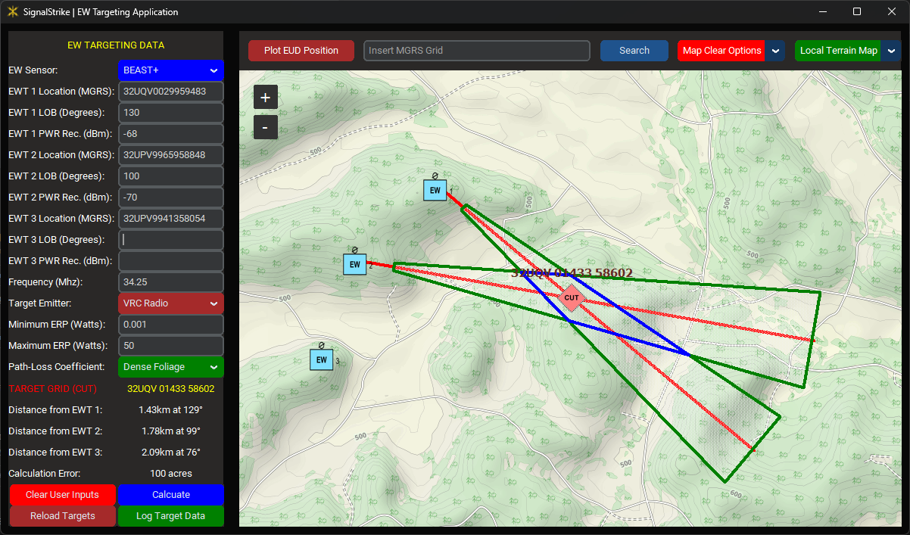

# Overview

The Electromagnetic Warfare Targeting Application, named SignalStrike, supports EW platoons' operations by streamlining their targeting process. Users input a LOB 3-Line (Sensor MGRS, LOB orientation, PWR Received), and the application reverse-engineers the target signal, identifying the location of potential targets in real-time. The application allows the aggregation of EW targeting data from up to three EW teams (EWTs). The application integrates target data onto an offline digital map to enhance situational awareness and enable precise targeting. This innovative tool empowers EW units to aggregate target data across their EWTs, significantly reducing the time required to detect, identify, and deliver effects on targets with decisive levels of efficiency and accuracy.


# Installation

#### Install on Linux:
```bash
# download package information from all configured sources 
sudo apt-get update
# install python
sudo apt-get install python
# verify python version
python --version
# install git
sudo apt install git-all
# clone git repository
git clone "https://github.com/Shuttdown700/ew_plt_targeting_app"
# change directory to EW Target App directory
cd ./ew_plt_targeting_app
# create a virtual python environment titled "venv"
python -m venv env
# activate the virtual environment
source ./venv/bin/activate
# install required python modules
python -m pip install -r requirements.txt
```

#### Install on Windows:
1. Download **Python**

    **Method 1:** Download from the Microsoft Store

    **Method 2:** Download from [Python.org](https://www.python.org/downloads/)

2. Download **Git for Windows** from [git-scm.com](https://git-scm.com/download/win)

3. Open a **Command (cmd) Prompt** and input the following commands:
```sh
# ensure Git is updated
git update-git-for-windows
# verify python version
python --version
# clone git repository
git clone "https://github.com/Shuttdown700/ew_plt_targeting_app"
# change directory to EW Target App directory
cd ./ew_plt_targeting_app
# create a virtual python environment titled "venv"
python -m venv venv
# activate the virtual environment
source ./venv/scripts/activate
# update Python's Pip module
python -m pip install --upgrade pip
# install required python modules
python -m pip install -r requirements.txt
```

# Run Application
- From Window's command prompt:
```sh
# Start the EW Targeting Application
run.bat
```
- From Linux Bash shell:
```bash
# Start the EW Targeting Application
source run.sh
```

# User-Interface Layout


# Functions
### **Single LOB Targeting Function:**
This essential function allows an estimated target location to be derived from a single sensor's LOB. The user must assume the target transmitter's minimum and maximum effective radiated power (ERP). The application will reverse-engineer the received signal to generate an estimated transmission origin and highlight the area of error where the transmitter may be located based on sensor and environmental parameters.


### **Multi-LOB Targeting Function (CUT/FIX):**
Sensor data from multiple EWTs can be simultaneously input to derive CUTs and FIXs: CUTs are in BLUE, and FIXs are in YELLOW. Notice that the target error (measured in acres) significantly reduces from LOB to CUT (18x smaller in this example) while the target error only slightly reduces from CUT to FIX (x3 smaller in this example). The application treats non-intersecting LOBs as two separate LOBs, and the target data from both LOBs will be displayed, allowing for EWTs to target separate transmitters simultaneously.




### **Locally-Host Map Server:**
The map tiles for the interactive map are downloaded into a local database and served via a locally-hosted map server. This function provides the user with a map service in an offline, austere environment. The map server is an HTTP server that launches when the app starts.


#### **Dynamic Map Download Service**
When a public internet connection is detected, the dynamic map tile download service will detect missing map tiles that the user is requesting to the map server and download them at an interval of 10-15 seconds. This function allows the user to easily download map tiles when they have an internet connection for later use or to view new areas of the map with ease, knowing that any missing map data will be quickly downloaded based on the user's activity. If there is no detected public internet connection, the dynamic map download service will terminate following the application's start.


#### **Dynamic Marker Plotting**
Various general-use tools are built into the application, including dynamic marker plotting. Marker plotting is done by right-clicking (or, on a tablet, long-pressing) the map and selecting "Add Generic Marker." This will plot a marker on the map with a number, which increments based on the number of genetic markers currently plotted on the map.


#### **Dynamic Distance Measuring**
The user can measure distances on the map by plotting two generic markers. The application calculates the distance between the two markers and displays the distance between the two markers.


#### **Grid Copying Feature**
User feedback from the first round of field experimentation generated a requirement for a quick way for the user to plot EWT locations when knowing where on the map the EWT is operating. The user can right-click (or, on a tablet, long-pressing) the map and select "Copy MGRS Grid." The MGRS grid from the chosen location will be displayed and copied to the clipboard. The user can then paste the MGRS grid into a user input field by pasting or (on a tablet) long-holding on the input field.


# Planned Future Functions
#### **Terrain Context in Targeting Function**
#### **Service for receiving remote sensor data**
#### **Integrated EW Planning Function**
#### **Advanced Logging Features**
#### **Post-Mission Analysis Function**
#### **Unit Testing (for more rapid application development)**
